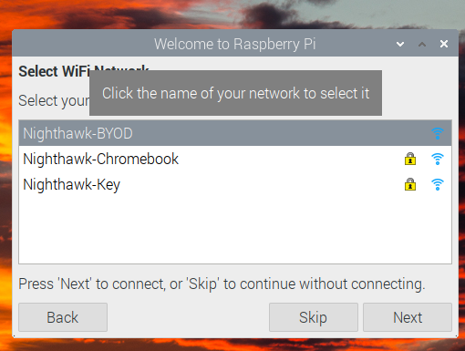
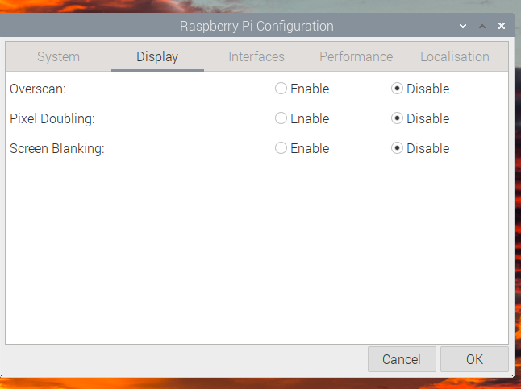
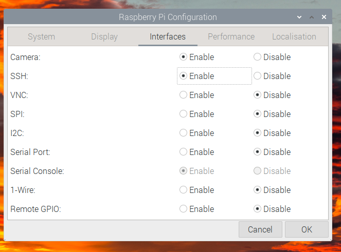
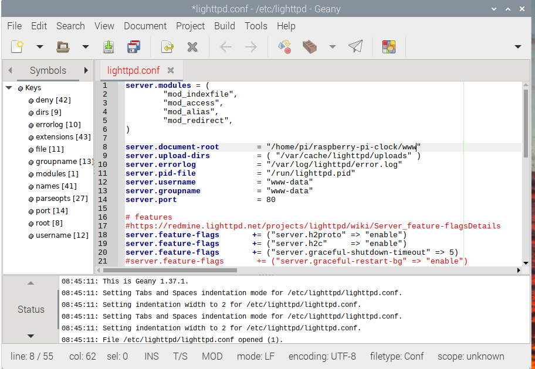

# raspberry-pi-clock

Some scripts and html to make a clock out of a Raspberry Pi. Original clock html was from [this](https://ampron.eu/article/use-case/digital-wall-clock-with-raspberry-pi/) excellent article from Ampron. Added Date to original clock, changed colors, and added flipping the date and time every hour to prevent screen burn in.

## Setup

### Install OS

* Install [Rasbian](https://www.raspberrypi.com/software/) on to Raspberry Pi
* Use Raspberry Pi imager to write image onto MicroSD Card
* Select Raspberry Pi OS (32-bit)

* Select SD card under storage
* Click Write

### Raspberry Pi Setup

* Install SD card into Raspberry PI
* Hook up Mouse, Keyboard, Monitor, and Power to Raspberry Pi
* Wait for device to boot
* Setup Location

* Change Password (Ask your teacher)

* Setup WIFI (Nighthawk-BYOD)

* Open Raspberry Pi Configuration (in Raspberry Menu)

* Disable Screen Blanking

* Enable SSH 

### Clock Setup

#### Open the terminal application

Clone this Repository into the home directory

`
git clone https://github.com/david-fry/raspberry-pi-clock.git
`

Install Web Server and change the serving directory

`sudo apt-get -y install lighttpd`

`sudo xdg-open /etc/lighttpd/lighttpd.conf`

Change the "server.document-root" from "/var/www/html" to "/home/pi/raspberry-pi-clock/www"

### Final Configuration

Install unclutter to hide mouse cursor

`sudo apt-get install -y unclutter`

Configure X Windows to use a special script on start-up, this will automate the clock starting

` ln -s raspberry-pi-clock/.xsession .xsession `

Reboot the Raspberry PI

sudo reboot

## Done!
