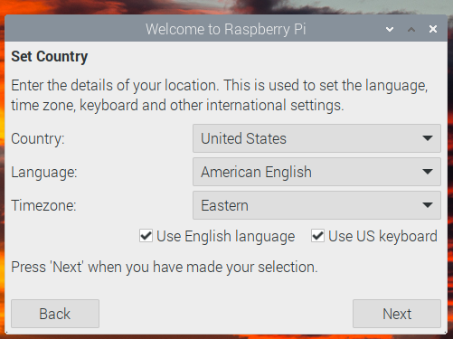
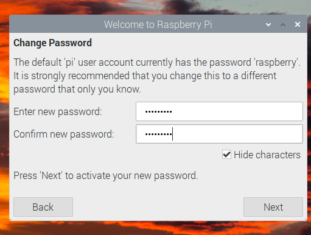

# raspberry-pi-clock
Some scripts and html to make a clock out of a Raspberry Pi. Original clock html was from [this](https://ampron.eu/article/use-case/digital-wall-clock-with-raspberry-pi/) excellent article from Ampron.

## Setup

### Install OS

* Install [Rasbian](https://www.raspberrypi.com/software/) on to Raspberry Pi
* Use Raspberry Pi imager to write image onto MicroSD Card
* Select Raspberry Pi OS (32-bit)

* Select SD card under storage
* Click Write

### Raspberry Pi Setup

* Install SD card into Raspberry PI
* Hook up Mouse, Keyboard, Monitor, and Power to Raspberry Pi
* Wait for device to boot
* Setup Location

* Change Password (Ask your teacher)

### Clock Setup

git clone https://github.com/david-fry/raspberry-pi-clock.git

sudo apt-get -y install lighttpd

sudo xdg-open /etc/lighttpd/lighttpd.conf

edit config file

sudo apt-get install -y unclutter

ln -s raspberry-pi-clock/.xsession .xsession

sudo reboot
